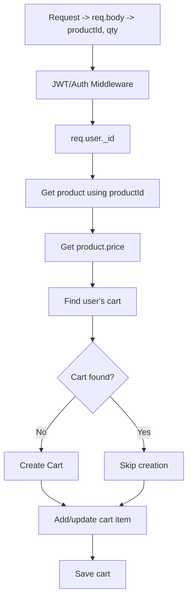

# notes
- add ratelimiter

# Cart API Flows

## 1. POST `/cart/additem`

### API flow
1. **Request** `productId, qty`
2. **JWT/Auth Middleware**
3. Extract `req.user._id`
4. Get product using `productId`
5. Get `product.price`
6. Find user's cart
7. If cart not found, **create one**; else **skip**
8. Add/update cart item 
9. **Save cart**

### Mermaid Flowchart

## 2. DELETE `/cart/removeitem`

### API flow
1. **Request**
2. **JWT/Auth Middleware**
3. Extract `req.user._id`
4. Find user's cart 
5. **Create Order** from `cart.items`
6. save Order
7. **clear cart**